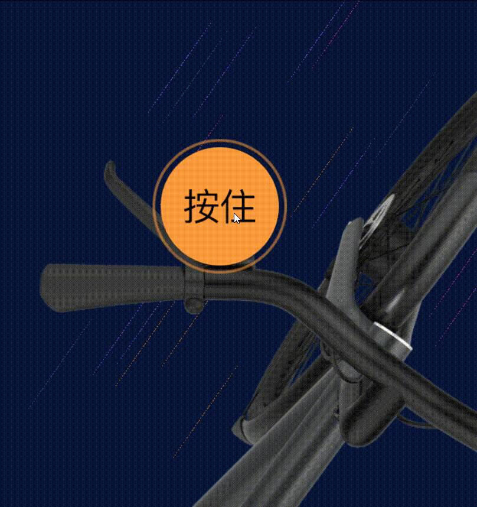
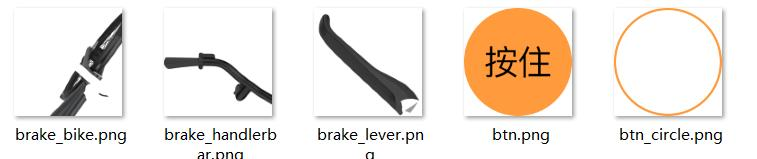

## 效果预览

<p align="center">
  
</p>


[项目预览](https://xluoyu.github.io/pixi-brake/)

## 项目分析

首先可以看到，我们是要通过循环滚动的背景来展现自行车在路上骑行的场景，并伴随着按住按钮，刹车把手旋转一定角度，背景停止滚动，实现刹车效果。

实现重点：
- 滚动的背景
- 刹车按钮按下后的交互

所用到的库：
- [PIXI](http://pixijs.huashengweilai.com/)

> Pixi是一个非常快的2D sprite渲染引擎，它可以帮助你显示、动画和管理交互式图形，轻松地使用JavaScript和其他HTML5技术制作游戏和应用程序。

- [GSAP](https://greensock.com/docs/)

> GSAP是一个从flash时代一直发展到今天的专业动画库

## 代码实现

首先是HTML部分

```html
<body>
  <div id="brakebanner"></div>
  
  <script src="https://pixijs.download/release/pixi.min.js"></script>
  <script src="https://cdnjs.cloudflare.com/ajax/libs/gsap/3.10.4/gsap.min.js"></script>
  <script src="./js/brakebanner.js"></script>
  <script>
      window.onload = init;

      function init() {
          let banner = new BrakeBanner("#brakebanner");
      }
  </script>
</body>
```

开始进入重点，进行初始化

```js
class BrakeBanner{
	constructor(selector){
    // 初始化PIXI实例
		this.app = new PIXI.Application({
			width: window.innerWidth,
			height: window.innerHeight,
			backgroundColor: 0x061639, // PIXI只接受十六进制颜色值
			resizeTo: window // 根据window自动调整容器大小
		})

    // 注入到DOM节点中
		document.querySelector(selector).appendChild(this.app.view)

    // 实例化一个加载器
		this.loader = new PIXI.Loader()
    // 这里是PIXI的舞台，后面创建的所有实例都要添加到舞台中
		this.stage = this.app.stage

    // 资源库，所有加载到的东西都会放在这里
		this.resources = this.loader.resources

    // 添加要加载的图片资源 (key, path)
		this.loader.add("btn.png", "images/btn.png")
		this.loader.add("brake_bike.png", "images/brake_bike.png")
		this.loader.add("brake_handlerbar.png", "images/brake_handlerbar.png")
		this.loader.add("brake_lever.png", "images/brake_lever.png")
		this.loader.add("btn_circle.png", "images/btn_circle.png")


    // 开始加载
		this.loader.load()

    // 加载完成的回调
		this.loader.onComplete.add(() => {
			this.show()
		})
	}
  ...
}
```
本项目用到的资源


我们分为三个步骤，创建背景、自行车、交换按钮。
> 注意！PIXI是由创建顺序决定层级，最后创建的会至于最上层，遮盖下方的图层。
```js
{
  show() {
    const backgroundAction = this.createBackground() // 创建背景
    const bikeContainer = this.createBike() // 创建自行车

    this.createActionButton({ // 创建交互按钮
      // 按钮按下时触发的事件
      pause: [
        backgroundAction.pause,
        bikeContainer.pause
      ],
      // 按钮松开后触发的事件
      start: [
        backgroundAction.start,
        bikeContainer.start,
      ]
    })
  },
  createBackground() {
    ...
  },
  createBike() {
    ...
  },
  createActionButton() {
    ...
  }
}
```

### 背景实现

背景其实就是一些运动状态的小点，我们可以先在容器中创建这些点。
```js
createBackground() {
  // 创建一个容器
	const particleContainer = new PIXI.Container()
  // 将背景的容器添加到舞台上
	this.stage.addChild(particleContainer)

  // 圆点的集合
	const particles = []
  // 随便搞了些颜色
  const colors = [0x9966FF, 0x9455f1, 0xf233a4, 0x336699, 0xff7904]

  // 绘制20个点
  for (let i = 0; i < 20; i++) {
    // 创建一个圆点
			let gr = new PIXI.Graphics()
      // 随机填充颜色
			gr.beginFill(colors[Math.floor(Math.random()*colors.length)])
      // 设置圆点的x、y、半径
			gr.drawCircle(0,0,4)
      // 完成绘制
			gr.endFill()

      // 记录当前的点
			let pItem = {
				sx: Math.random()*window.innerWidth,
				sy: Math.random()*window.innerHeight,
				gr: gr
			}

      /**
       * 设置横纵坐标为屏幕内随机一点
       */
			gr.x = pItem.sx   
			gr.y = pItem.sy
      
      // 添加到容器内
			particleContainer.addChild(gr)

      // 记录这个点
			particles.push(pItem)
		}
}

```

现在绘制出的点分布在了整个屏幕，接着就开始添加滚动的动画。

```js
createBackground() {
  ...
  let speed = 0 // 设置一个初始速度

  // 运动函数，在每个动画帧上执行
  function loop() {
    speed += .5 // 速度加0.5
    speed = Math.min(speed, 30) // 最大值30

    /**
     * 改变每个圆点的Y轴坐标
     */
    for(let i = 0; i < particles.length; i++) {
      let pItem = particles[i]

      pItem.gr.y += speed

      /**
       * 现在看起来只是一些运动的点
       * 为了更符合动态效果，我们要模拟视觉残留的样子
       * 
       * 在大于一定的速度时，圆点会变成一条细线
       * 
       * 这里我们对点的Y方向拉伸，X方向缩小，将其变成细线
       * 
       * 注意X要改的足够小，这样才有点状的效果
       */
      if (speed >= 20) {
        pItem.gr.scale.y = 20
        pItem.gr.scale.x = .05
      }

      // Y轴坐标超出时，回到顶部
      if (pItem.gr.y > window.innerHeight) {
        pItem.gr.y = 0
      }
    }
  }

  // 添加gsap帧动画
  gsap.ticker.add(loop)

  // 开始
  function start() {
    speed = 0
    gsap.ticker.add(loop)
  }

  // 暂停
  function pause() {
    gsap.ticker.remove(loop)
    
    for(let i = 0; i < particles.length; i++) {
      let pItem = particles[i]

      // 将圆点的scale还原
      pItem.gr.scale.y = 1
      pItem.gr.scale.x = 1

      // 坐标回到初始值，添加缓动效果
      // https://greensock.com/docs/v3/Eases
      gsap.to(pItem.gr, {duration: .3, x: pItem.sx, y: pItem.sy, ease: 'elastic.out'})
    }
  }

  return {
    start,
		pause
  }
}
```

现在背景完成了，但此时背景还是竖直的，而我们的车子是斜向的，我们只需要将`particleContainer`背景容器旋转一定角度即可

```js
const particleContainer = new PIXI.Container()
this.stage.addChild(particleContainer)

/**
 * 因为我们是要将整个背景顺时针旋转，
 * 正常情况下的旋转中心是在左上角，所以我们需要修改一下中心点
 */
particleContainer.pivot.x = window.innerWidth/2
particleContainer.pivot.y = window.innerHeight/2

/**
 * 修改完中心点后，背景的坐标也会依照中心点的位置跑到左上角
 * 
 * 现在我们还需要根据中心点，修改坐标位置
 */
particleContainer.x = window.innerWidth/2
particleContainer.y = window.innerHeight/2

// 旋转35°
particleContainer.rotation = Math.PI/180*35
...
```

### 自行车

```js
createBike() {
  // 创建自行车的容器
  const bikeContainer = new PIXI.Container()
  this.stage.addChild(bikeContainer)

  // 自行车骨架
  // 从资源库中取出骨架的图片
  const bikeImage = new PIXI.Sprite(this.resources['brake_bike.png'].texture)
  bikeContainer.addChild(bikeImage)

  // 刹车握把
  const brakeLeverImage = new PIXI.Sprite(this.resources['brake_lever.png'].texture)
  bikeContainer.addChild(brakeLeverImage)

  // 设置坐标
  brakeLeverImage.pivot.x = 455
  brakeLeverImage.pivot.y = 455

  brakeLeverImage.x = 722
  brakeLeverImage.y = 900

  // 自行车支架
  const brakeHandlerbarImage = new PIXI.Sprite(this.resources['brake_handlerbar.png'].texture)
  bikeContainer.addChild(brakeHandlerbarImage)

  // 资源图片较大，调整一下
  bikeContainer.scale.x = bikeContainer.scale.y = 0.3

  /**
   * 将组行车的位置固定在右下角
   */
  const resize = () => {
    bikeContainer.x = window.innerWidth - bikeContainer.width
    bikeContainer.y = window.innerHeight - bikeContainer.height
  }
  window.addEventListener('resize', resize)
  resize()

  function pause() {
    /**
     * 暂停时刹车把手旋转，车身抖动
     */
    gsap.to(brakeLeverImage, {duration: .4, rotation: Math.PI/180*-30})
    gsap.to(bikeContainer, {duration: .2, y: bikeContainer.y + 6, ease: 'linear'})
    gsap.to(bikeContainer, {duration: .1, y: bikeContainer.y, ease: 'linear', delay: .2})
  }

  /**
   * 松开后旋转回来
   */
  function start() {
    gsap.to(brakeLeverImage, {duration: .2, rotation: 0})
  }

  return {
    pause,
    start
  }
}
```

### 交互按钮

```js
/**
 * action = {
 *  pause: function[],
 *  start: function[]
 * }
 */
createActionButton(action) {
  /**
   * 依然是创建容器，置于舞台上
   */
  let actionButton = new PIXI.Container()
  this.stage.addChild(actionButton)

  // 随便定个坐标
  actionButton.x = actionButton.y = 300

  // interactive：可交互； buttonMode： 鼠标变成小手
  actionButton.interactive = true
  actionButton.buttonMode = true

  // 拉取资源
  let btnImage = new PIXI.Sprite(this.resources['btn.png'].texture)
  let btnCircle = new PIXI.Sprite(this.resources['btn_circle.png'].texture)

  // 添加到容器
  actionButton.addChild(btnCircle)
  actionButton.addChild(btnImage)

  // 调整大小，中心点都改为圆心点
  btnImage.pivot.x = btnImage.pivot.y = btnImage.width / 2
  btnCircle.pivot.x = btnCircle.pivot.y = btnCircle.width / 2
  btnCircle.scale.x = btnCircle.scale.y = 0.8

  // 添加动画，repeat：一直执行
  gsap.to(btnCircle.scale, {duration:1, x: 1.1, y: 1.1, repeat: -1})
  gsap.to(btnCircle, {duration:1, alpha: 0, repeat: -1})

  // 按下后
  actionButton.on('mousedown', () => {
    action.pause.forEach(item => item())
  })

  // 松开后
  actionButton.on('mouseup', () => {
    action.start.forEach(item => item())
  })

  return actionButton
}
```

## 最后

[项目预览](https://xluoyu.github.io/pixi-brake/)

[源码地址](https://github.com/xluoyu/pixi-brake)

[【大帅老猿】前端canvas动效开发实战，PIXI+GSAP仿写vanmoof刹车动效。直播回放](https://www.bilibili.com/video/BV1q34y1n7dA/)