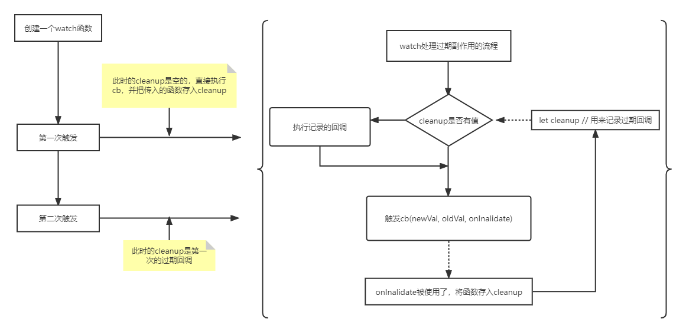

## watch的实现

`watch`的本质就是监测一个响应式数据，当数据发生变化时执行响应的回调函数。

```js

watch(obj, () => {
  console.log('数据发生变化了')
})

obj.foo++
```

我们可以通过`effect`以及`scheduler`来实现
```js
function watch(source, cb) {
  effect(
    () => source,
    {
      scheduler() {
        cb()
      }
    }
  )
}
```
这里在执行`() => source`时，就会读取`source`的值，来触发`track`收集。然而，如果传入的`source`是一个对象，那么我们需要读取对象内的每一个值，来使得对象上任意属性发生变化时都能触发回调函数。

```js
// 循环读取对象内的每一个属性
function traverse(value, seen = new Set()) {
  // 不考虑原始值、null、已读取过的情况
  if (typeof value !== 'object' || value === null || seen.has(value)) {
    return
  }

  seen.add(value)

  // 先考虑对象，使用for...in遍历对象的所有属性
  for (const k in value) {
    traverse(value[k], seen)
  }

  return value
}

export function watch(source, cb) {
  effect(
    () => traverse(source),
    {
      scheduler() {
        cb()
      }
    }
  )
}
```

除了`source`是个对象外，还要考虑其是个`getter`函数

```js
watch(() => obj.foo, () => {
  console.log('obj.foo 发生了改变')
})
```

```js
export function watch(source, cb) {
  /**
   * 我们判断一下source的情况进行封装
   */
  let getter

  if (typeof source === 'function') {
    getter = source
  } else {
    getter = () => traverse(source)
  }

  effect(
    () => getter(),
    {
      scheduler() {
        cb()
      }
    }
  )
}
```

之后我们还要在`cb`中返回新值与旧值。

```js
export function watch(source, cb) {
  let getter

  if (typeof source === 'function') {
    getter = source
  } else {
    getter = () => traverse(source)
  }
  let oldValue, newValue;

  const effectFn = effect( // 将副作用函数返回出来
    () => getter(),
    {
      lazy: true, // 这里我们要用上lazy属性
      scheduler() {
        newValue = effectFn() // 得到新值
        cb(newValue, oldValue)
        oldValue = newValue // 赋给旧值
      }
    }
  )

  oldValue = effectFn() // 第一次执行， 得到的值赋给旧值
}
```

## 立即执行的watch

在`Vue`中，我们通过给`watch`设置参数`{immediate: true}`，来立即执行。

```js
watch(() => obj.foo, () => {
  console.log('obj.foo 发生了改变')
}, {
  immediate: true
})
```

也就是说，当我们在执行`watch`函数时，直接执行调度器内的内容。

```js
function watch(source, cb, options = {}) {
  let getter

  if (typeof source === 'function') {
    getter = source
  } else {
    getter = () => traverse(source)
  }
  let oldValue, newValue;

  // 这里将调度器的内容重新封装，方便直接调用
  const job = () => {
    newValue = effectFn() // 得到新值
    cb(newValue, oldValue)
    oldValue = newValue // 赋给旧值
  }

  const effectFn = effect( // 将副作用函数返回出来
    () => getter(),
    {
      lazy: true, // 这里我们要用上lazy属性
      scheduler: job
      // scheduler() {
        // newValue = effectFn() // 得到新值
        // cb(newValue, oldValue)
        // oldValue = newValue // 赋给旧值
      // }
    }
  )

  if (options.immediate) {
    job()
  } else {
    oldValue = effectFn() // 第一次执行， 得到的值赋给旧值
  }
}

```

## flush

书中还介绍了`flush`属性
```js
watch(() => obj.foo, () => {
  console.log('obj.foo 发生了改变')
}, {
  flush: 'sync' // 还可以选的值为`'pre'`或`'post'`
})
```
`'sync'`表示同步执行，`'pre'`表示在组件更新前执行，`'post'`表示在组件更新后执行。

这里简单摸一下`post`的情况，因为`pre`设计到了组件更新的问题...

```js
const effectFn = effect( // 将副作用函数返回出来
    () => getter(),
    {
      lazy: true, // 这里我们要用上lazy属性
      scheduler: () => {
        // 在`flush`设置为`post`，我们将所执行的函数放至微任务中执行。
        if (options.flush === 'post') {
          const p = Promise.resolve()
          p.then(job)
        } else {
          job()
        }
      }
    }
  )
```

## 过期的副作用函数

这里要先说明一下什么是过期的副作用（竞态问题）？

举个栗子
```js
const finalData

watch(obj, async () => {
  const res = await fetch('/api')

  finalData = res
})

```
这里在每次`obj`发生改变时都会请求接口，使得`finalData`为接口返回值。但是如果在我们第一次请求发出并且结果未返回前，再次修改`obj`发出一条新的请求。此时两个请求都在进行中，我们并不知道哪一个请求会先完成，所以`finalData`的值也就不能保证时最新的值。

我们希望能有一个让副作用过期的手段。在`Vue`中，`watch`函数的回调函数提供了第三个参数`onCleanup`。

```js
watch(obj, async (newVal, oldVal, onCleanup) => {
  let expired = false // 用来表示当前这个副作用函数是否过期
  
  // 如果这个副作用函数过期了，会执行`onCleanup`传入的函数
  onCleanup(() => {
    expired = true // 过期了
  })

  const res = await fetch('/api')
  if (expired) return // 如果过期了，就不要执行下面的代码了
  finalData = res
})
```

那么功能方便怎么实现呢？

我们只需要在`watch`执行`cb`函数前，调用一下上一个`watch`函数中的`onCleanup`函数，就可以让上一个副作用过期了。



> 在`watch`的`cb`函数中，声明变量来记录过期状态作用域仅在本次调用时，所以不会影响到下一次调用。

明白功能流程，我们就可以实现代码了。

```js
export function watch(source, cb, options = {}) {
  let getter

  if (typeof source === 'function') {
    getter = source
  } else {
    getter = () => traverse(source)
  }
  let oldValue, newValue, cleanup; // 多声明一个变量来记录过期回调

  function onInvalidate(fn) {
    cleanup = fn
  }

  // 这里将调度器的内容重新封装，方便直接调用
  const job = () => {
    newValue = effectFn() // 得到新值
    // 如果有过期回调，就执行它，使上一次的副作用过期
    if (cleanup) {
      cleanup()
    }
    cb(newValue, oldValue, onInvalidate)
    oldValue = newValue // 赋给旧值
  }

  const effectFn = effect( // 将副作用函数返回出来
    () => getter(),
    {
      lazy: true, // 这里我们要用上lazy属性
      scheduler: () => {
        // 在`flush`设置为`post`，我们将所执行的函数放至微任务中执行。
        if (options.flush === 'post') {
          const p = Promise.resolve()
          p.then(job)
        } else {
          job()
        }
      }
    }
  )

  if (options.immediate) {
    job()
  } else {
    oldValue = effectFn() // 第一次执行， 得到的值赋给旧值
  }
}
```